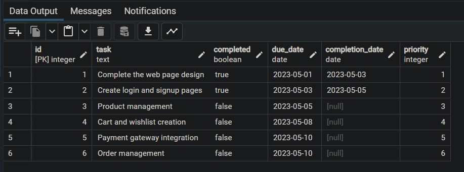
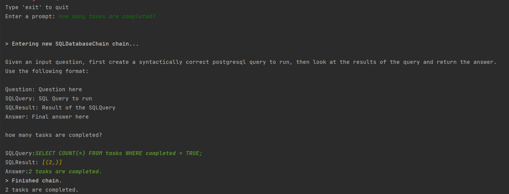

create .env file with the following configuration
OPENAI_API_KEY=<YOUR_OPEN_API_KEY>
DBPASS=<YOUR_PASSWORD>
DATABASE=coddicted_db

```shell
pip install langchain openai python-environ psycopg2-binary
pip install langchain-experimental
```

```shell
docker pull postgres
docker run -itd -e POSTGRES_USER=admin -e POSTGRES_PASSWORD=<YOUR_PASSWORD> -p 5432:5432 -v /data:/var/lib/postgresql/data --name postgresql postgres
docker pull dpage/pgadmin4:latest
docker run --name pgadmin-coddicted -p 5051:80 -e "PGADMIN_DEFAULT_EMAIL=payam@coddicted.com" -e "PGADMIN_DEFAULT_PASSWORD=<YOUR_PASSWORD>" -d dpage/pgadmin4
## To find the ip address of the container
docker inspect postgresql -f "{{json .NetworkSettings.Networks }}"
```





#### References
- https://coinsbench.com/chat-with-your-databases-using-langchain-bb7d31ed2e76
- https://www.baeldung.com/ops/postgresql-docker-setup
- https://stackoverflow.com/questions/44561378/escape-password-containing-when-using-postgres-pg-dump-command
- https://github.com/langchain-ai/langchain/issues/8524
- https://stackoverflow.com/questions/25540711/docker-postgres-pgadmin-local-connection
- https://superuser.com/questions/1586386/how-to-find-wsl2-machines-ip-address-from-windows
- https://www.psycopg.org/docs/install.html